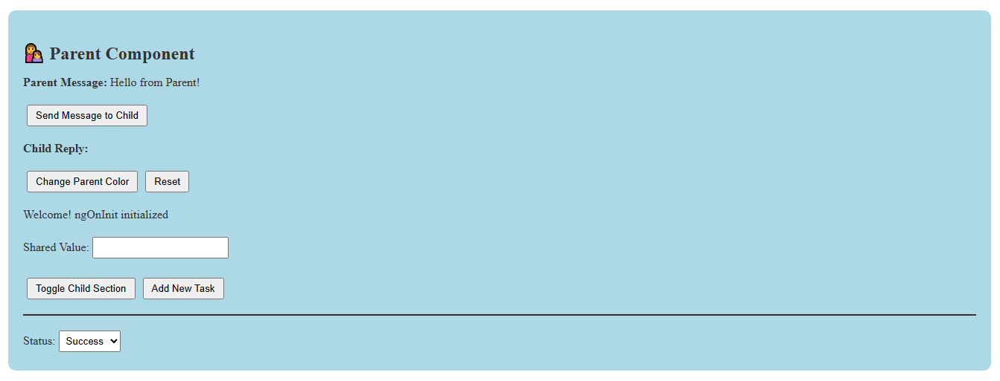

# 🧩 Angular Parent-Child Communication Demo

---

A simple **Angular learning project** demonstrating how to share data between **Parent and Child components** using:
- @Input() – Passing data from parent to child
- @Output() + EventEmitter – Sending data/events from child to parent

---

## 🚀 Features
- ✅ Parent sends data (e.g., a message or number) to child component using @Input
- ✅ Child sends data back to parent using @Output + EventEmitter
- ✅ Real-time updates between parent and child UI
- ✅ Easy-to-understand Angular code for beginners

---

## 🛠️ Tech Stack
- **Frontend:** Angular 17
- **Language:** TypeScript, HTML, SCSS

---

## 📸 Screenshot

---

## 🚀 Author
 **Safeeya Munawwar**
 

  
  
  
  

---

© 2025 Angular Parent-Child Communication Demo | Built with ❤️ for learning

